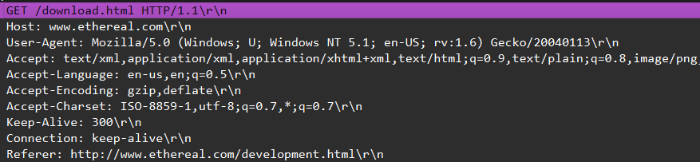
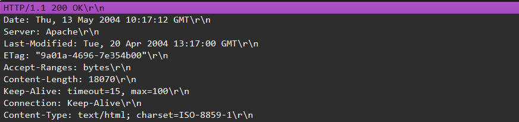
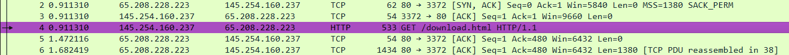
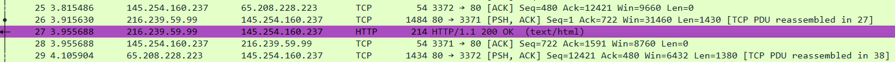
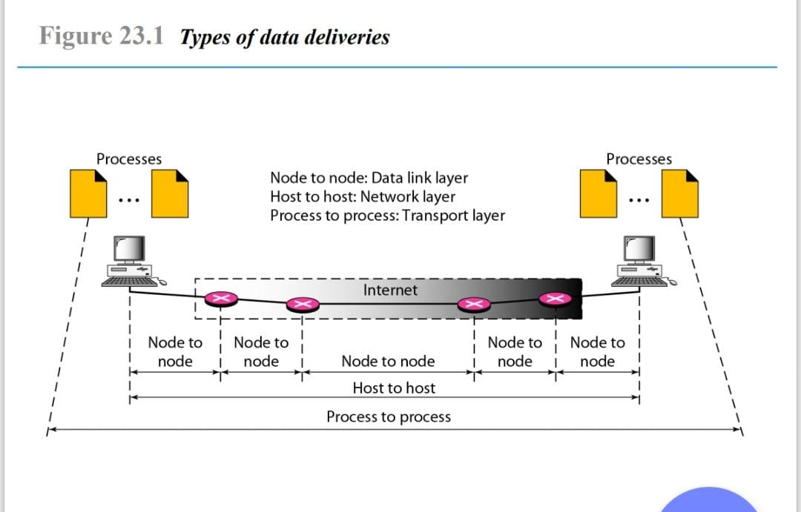

  <h1 style="text-align: center;font-weight: bold">Laporan Praktikum Workshop Administrasi Jaringan TCP/IP</h1>
  <h4 style="text-align: center;">Dosen Pengampu : Dr. Ferry Astika Saputra, S.T., M.Sc.</h4>

 

  
  <h3 style="text-align: center;">Disusun Oleh :</h3>
  

    <strong>Calvin Raditya Sandy Winarto</strong> 
    <strong>3123500009</strong> 
    <strong>2 D3 IT A</strong>
  

<h3 style="text-align: center;line-height: 1.5">Politeknik Elektronika Negeri Surabaya Departemen Teknik Informatika Dan Komputer Program Studi Teknik Informatika 2025/2026</h3>
  

 

- [Apa itu TCP/IP?](#apa-itu-tcpip)
- [Analisis File http.cap dengan Wireshark](#analisis-file-httpcap-dengan-wireshark)
- [Type of data deliveries](#type-of-data-deliveries)
- [Kesimpulan](#kesimpulan)

# Apa itu TCP/IP?

  **TCP/IP (Transmission Control Protocol / Internet Protocol)**  adalah sekumpulan protokol yang mengatur cara perangkat komputer berkomunikasi di jaringan, baik itu jaringan lokal (LAN) maupun jaringan global seperti internet. `TCP/IP` berfungsi sebagai dasar dari komunikasi data di dunia maya dan menjadi fondasi utama bagi keberadaan internet.
 

## Analisis File http.cap dengan Wireshark

1) Analisis file `http.cap` dengan Wireshark meliputi identifikasi versi HTTP, alamat IP klien dan server, waktu pengiriman permintaan oleh klien, waktu respons dari server, serta durasi antara permintaan dan respons.

    - **Versi HTTP yang digunakan**
    
    

    - **IP Address dari client maupun server**
        - Client
            
        - Server
            

    - **Waktu dari client mengirimkan HTTP request.**
        - Client
            
            Waktu Client mengirimkan HTTP request ada pada detik ke **0,911310**
        - Server
            
            Waktu Server mengirimkan HTTP request ada pada detik ke **3,955688**

    - **Durasi pengiriman untuk menyelesaikan HTTP Response**
        - Client membutuhkan waktu `4,846969` untuk mengirimkan HTTP request
        - Server membutuhkan waktu `3,955688` untuk mengirimkan HTTP request

        Jadi, perhitungannya adalah `4,846969` - `3,995688` = `0,891281`

        Dibutuhkan waktu `0,891281` detik untuk menyelesaikan 1 kali HTTP Response.

## Type of data deliveries

**Proses pengiriman data**
    

1) **Node to Node (Data Link Layer)**

    **Data Link Layer** merupakan lapisan kedua dari bawah dalam model arsitektur jaringan **OSI (Open System Interconnection)**. Lapisan ini bertanggung jawab atas pengiriman data dari satu node ke node lain dalam jaringan lokal yang sama. Peran utamanya adalah memastikan transmisi informasi bebas kesalahan. DLL juga bertanggung jawab atas pengodean, pengodean ulang, dan pengorganisasian data keluar dan masuk.
    - Data dikirim dari satu node jaringan (misalnya, router atau switch) ke node berikutnya
2) **Host to Host (Network Layer)**

    **Host to Host** adalah lapisan protokol tepat di atas lapisan jaringan internet. Lapisan ini bertanggung jawab atas integritas data ujung ke ujung. Dua protokol terpenting yang digunakan pada lapisan ini adalah **Transmission Control Protocol (TCP)** dan User Datagram Protocol (UDP).
    - Data dikirim dari satu host (komputer) ke host lain melalui jaringan
3) **Process to Process (Transport Layer)**

    **Transport Layer** bertanggung jawab atas pengiriman proses ke proses dari pengiriman sebuah paket, bagian dari pesan, dari satu proses ke proses lainnya. Dua proses
    berkomunikasi dalam hubungan klien/server.
    - Data dikirim dari satu proses di komputer pengirim ke proses di komputer penerima.

## Kesimpulan

Dalam komunikasi jaringan, pengiriman data terjadi melalui tiga tahap utama, yaitu
1) **Node to Node (Data Link Layer)** – Data ditransmisikan antar perangkat jaringan (misalnya router atau switch) dalam jaringan lokal, memastikan pengiriman data yang bebas kesalahan.
2) **Host to Host (Network Layer)** – Data dikirim dari satu host (komputer) ke host lain melalui jaringan menggunakan protokol seperti IP untuk mengarahkan paket ke tujuan.
3) **Process to Process (Transport Layer)** – Data dikirim dari satu proses di komputer pengirim ke proses yang sesuai di komputer penerima, menggunakan protokol seperti TCP atau UDP untuk memastikan komunikasi yang andal.

Ketiga lapisan ini bekerja secara berurutan untuk memastikan bahwa data dikirim dengan benar dari sumber ke tujuan, baik di dalam jaringan lokal maupun melalui internet.