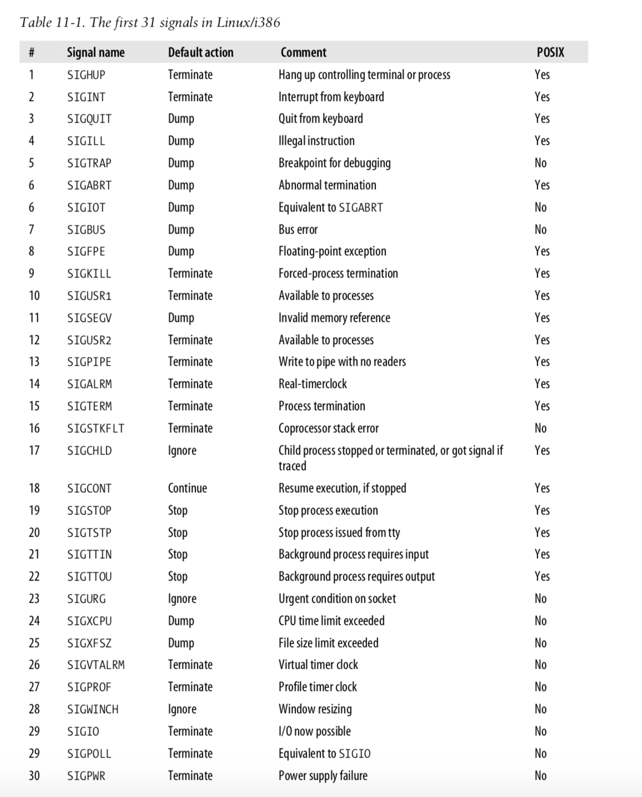
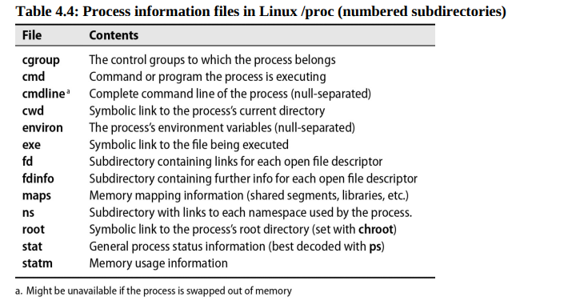

  <h1 style="text-align: center;font-weight: bold">Laporan Praktikum Workshop Administrasi Jaringan</h1>
  <h4 style="text-align: center;">Dosen Pengampu : Dr. Ferry Astika Saputra, S.T., M.Sc.</h4>

 

  
  <h3 style="text-align: center;">Disusun Oleh :</h3>
  

    <strong>Calvin Raditya Sandy Winarto</strong> 
    <strong>3123500009</strong> 
    <strong>2 D3 IT A</strong>
  

<h3 style="text-align: center;line-height: 1.5">Politeknik Elektronika Negeri Surabaya Departemen Teknik Informatika Dan Komputer Program Studi Teknik Informatika 2025/2026</h3>
  

 

<!-- - [Apa itu TCP/IP?](#apa-itu-tcpip)
- [Analisis File http.cap dengan Wireshark](#analisis-file-httpcap-dengan-wireshark)
- [Type of data deliveries](#type-of-data-deliveries)
- [Kesimpulan](#kesimpulan) -->

# Chapter 4 Process Control

## Komponen Proses
`Proses` adalah `entitas yang berisi kumpulan sumber daya yang dikelola oleh kernel untuk menjalankan sebuah program`. Komponen utamanya mencakup ruang alamat, yaitu sekumpulan halaman memori yang dialokasikan oleh kernel untuk proses tersebut. Halaman-halaman ini biasanya memiliki ukuran 4KiB atau 8KiB dan digunakan untuk menyimpan kode program, data, serta tumpukan eksekusi. Selain itu, kernel juga menggunakan struktur data untuk mencatat informasi penting terkait proses, seperti status eksekusi, prioritas, dan parameter penjadwalan.

Proses dapat di ibaratkan sebagai wadah yang menampung berbagai sumber daya yang dibutuhkan agar program dapat berjalan dengan baik. Sumber daya ini mencakup memori yang digunakan untuk menyimpan instruksi dan data, deskriptor file yang mengacu pada file yang sedang diakses, serta berbagai atribut lain yang menggambarkan kondisi proses.

Dalam sistem operasi, setiap proses dikelola melalui struktur data internal kernel yang mencakup:
 - Peta ruang alamat yang menunjukkan distribusi memori proses
 - Status proses saat ini (misalnya berjalan, menunggu, atau dihentikan)
 - Prioritas proses dalam sistem
 - Daftar sumber daya yang sedang digunakan, termasuk CPU dan memori
 - File serta port jaringan yang sedang dibuka oleh proses
 - Mask sinyal yang menentukan sinyal mana saja yang sedang diblokir
 - Identitas pengguna yang memiliki atau menjalankan proses

Selain proses, ada juga konsep thread yang memungkinkan eksekusi paralel dalam satu proses. Thread berbagi ruang alamat dan sumber daya dengan proses induknya, menjadikannya lebih ringan dibandingkan proses karena lebih efisien dalam hal pembuatan dan penghancuran.

## PID: Nomor ID Proses
`Setiap proses memiliki nomor identifikasi unik (PID)` yang diberikan oleh kernel saat dibuat. `PID` digunakan sebagai referensi dalam berbagai operasi sistem, seperti pengiriman sinyal. Dengan konsep namespace, proses yang berbeda dapat memiliki `PID` yang sama dalam lingkungan terisolasi, seperti pada kontainer. Ini memungkinkan beberapa instance aplikasi berjalan secara terpisah dalam satu sistem

## PPID (Parent Process ID) 
Nomor ID yang menunjukkan proses induk dari suatu proses. Sistem menggunakannya untuk melacak hubungan antarproses dan memungkinkan interaksi, seperti pengiriman sinyal ke proses induk.

## UID (User ID)
`User ID` pengguna yang memulai proses, sedangkan `EUID (Effective User ID) `menentukan izin akses proses terhadap sumber daya seperti file dan jaringan.

## Lifecycle of a Process
Proses baru dibuat dengan `fork`, yang menyalin proses asli dengan `PID berbeda`. Saat booting, kernel membuat proses awal seperti init atau systemd (PID 1), yang menjalankan skrip startup. Semua proses, kecuali yang dibuat langsung oleh kernel, berasal dari proses ini.

## Sinyal
Sinyal adalah mekanisme yang digunakan untuk memberi tahu suatu proses bahwa suatu peristiwa telah terjadi. Sinyal dapat dikirim oleh proses lain, terminal, administrator, atau kernel untuk berbagai tujuan, seperti komunikasi, kontrol proses, atau penanganan kesalahan.

### Penggunaan sinyal
 - Digunakan untuk komunikasi antarproses.
 - Dikirim oleh terminal untuk menghentikan, menginterupsi, atau menangguhkan proses.
 - Dapat dikirim oleh administrator menggunakan perintah _kill_.
 - Dikirim oleh kernel saat terjadi pelanggaran, seperti pembagian dengan nol.
 - Kernel menggunakannya untuk memberi tahu proses tentang status anak atau ketersediaan data I/O.

   

### Sinyal
- **KILL**
    - Tidak dapat diblokir atau ditangani oleh proses.
    - Menghentikan proses langsung pada tingkat kernel.
- **INT**
    - Dikirim oleh terminal saat pengguna mengetik perintah penghentian.
    - Program sederhana akan berhenti kecuali menangkap sinyal ini.
    - Program seperti shell biasanya membersihkan statusnya sebelum kembali menerima input.
- **TERM**
    - Permintaan untuk menghentikan eksekusi proses secara bersih.
    - Proses diharapkan menutup dengan baik sebelum keluar.
- **HUP**
    - Dikirim saat terminal pengendali ditutup.
    - Awalnya digunakan untuk menutup koneksi telepon.
    - Sering digunakan untuk me-restart daemon agar memuat ulang konfigurasi.
- **QUIT**
    - Mirip dengan **TERM** tetapi menghasilkan core dump jika tidak tertangkap.
    - Beberapa program menggunakan sinyal ini untuk tujuan khusus.

## Kill Mengirim Sinyal
Perintah _kill_ digunakan untuk mengirim sinyal ke proses, biasanya untuk menghentikannya. Secara default, _kill_ mengirim sinyal TERM, tetapi dapat dikonfigurasi untuk sinyal lain. Jika TERM tidak efektif, _kill_ -9 pid akan memaksa penghentian dengan sinyal _KILL_.

    kill [-signal] pid

- _kill_ adalah perintah untuk mengirim sinyal ke proses.
- `[-signal]` opsi untuk menentukan sinyal yang dikirim (misalnya, -9 untuk KILL atau -15 untuk TERM).
- `pid` nomor identifikasi proses `(Process ID)` yang menjadi target perintah.

## PS Monitoring Processes
Perintah ps digunakan untuk memantau proses dalam sistem. Ini menampilkan informasi seperti PID, UID, prioritas, penggunaan memori, waktu CPU, dan status proses.
- `ps aux` digunakan untuk menampilkan semua proses dengan detail:
    - `a` digunakan untuk menampilkan proses dari semua pengguna.
    - `u` digunakan untuk menampilkan informasi rinci.
    - `x` digunakan untuk menampilkan proses tanpa terminal terkait.

## Interactive monitoring with top
Perintah `top` menampilkan proses sistem secara real-time dan diperbarui otomatis setiap 1-2 detik. Pengguna dapat menyesuaikan tampilan.

Perintah `htop` adalah versi lebih canggih dengan antarmuka lebih baik, mendukung scrolling, dan memiliki lebih banyak fitur dibandingkan top.

## Nice and renice: changing process priority
Perintah nice digunakan untuk menetapkan prioritas proses saat menjalankannya. Nilai niceness berkisar dari -20 (prioritas tinggi) hingga +19 (prioritas rendah). Proses dengan prioritas lebih rendah akan mendapatkan lebih sedikit waktu CPU dibandingkan proses dengan prioritas lebih tinggi.

    nice -n nice_val [command]

- `nice_val` → Menentukan tingkat prioritas proses (-20 hingga +19 di Linux).
- `command` → Perintah yang akan dijalankan dengan prioritas tertentu
- `Prioritas Rendah (+19)` → CPU akan lebih memprioritaskan proses lain.
- `Prioritas Tinggi (-20)` → Proses akan mendapatkan lebih banyak waktu CPU.
- Jika tanpa `-n nice_val`, perintah akan berjalan dengan nilai default (biasanya 0).

## The /proc filesystem
Direktori `/proc` di Linux adalah sistem berkas semu yang menyimpan informasi tentang status sistem dan proses yang berjalan. Setiap proses memiliki direktori berdasarkan `PID-nya`, yang berisi data seperti baris perintah, variabel lingkungan, dan deskriptor berkas. Perintah seperti `ps` dan `top` menggunakan informasi dari `/proc`.

- Sistem berkas semu → Menyediakan informasi sistem dan proses.
- Setiap proses memiliki direktori `/proc/PID/` berisi informasi proses terkait.
-  Berisi berbagai berkas seperti
    - `cmdline` → Baris perintah yang menjalankan proses.
    - `environ` → Variabel lingkungan proses.
    - `fd/` → Deskriptor berkas yang digunakan proses.
- Digunakan oleh perintah `ps` dan `top` untuk membaca status sistem dan proses.

   

## Strace and truss
Di Linux dan FreeBSD, perintah strace melacak panggilan sistem dan sinyal proses, yang bermanfaat untuk debugging atau memahami perilaku program.

## Runaway processes
Proses yang tidak merespons dan menggunakan `CPU` secara berlebihan disebut proses kabur. Jika sinyal `TERM` tidak dapat menghentikannya, gunakan sinyal KILL dengan perintah `kill -9 pid` atau `kill -KILL pid` untuk menghentikan proses secara paksa.
- `Proses kabur` → Mengabaikan prioritas dan membebani CPU.
- `Sinyal TERM (kill pid)` → Upaya pertama untuk menghentikan proses.
- `Sinyal KILL (kill -9 pid atau kill -KILL pid)` → Memaksa proses berhenti jika TERM gagal.

Perintah `lsof -p PID` menampilkan daftar semua file yang sedang dibuka oleh proses dengan PID tertentu, termasuk file biasa, socket, dan pipe.

## Periodic processes
Cron adalah daemon penjadwalan tugas Linux yang berjalan terus-menerus sejak booting dan membaca konfigurasi crontab untuk mengeksekusi perintah secara otomatis pada titik tertentu. Untuk Linux dan FreeBSD, crontab pengguna disimpan di `/var/spool/cron` atau `/var/cron/tabs`.

## Format of crontab
File crontab memiliki lima bidang untuk menentukan hari, tanggal dan waktu yang diikuti dengan perintah yang akan dijalankan pada interval tersebut.

    *     *     *     *     *  command to be executed
    -     -     -     -     -
    |     |     |     |     |
    |     |     |     |     +----- day of week (0 - 6) (Sunday=0)
    |     |     |     +------- month (1 - 12)
    |     |     +--------- day of month (1 - 31)
    |     +----------- hour (0 - 23)
    +------------- min (0 - 59)

Contoh:

    # Run a command at 2:30am every day
    30 2 * * * command

    # Run a command at 10:30pm on the 1st of every month
    30 22 1 * * command

    # Run a Python script every 1st of the month at 2:30am
    30 2 1 * * /usr/bin/python3 /path/to/script.py

## Systemd timer
Systemd timer adalah alternatif yang lebih fleksibel dan kuat dibandingkan cron untuk menjadwalkan tugas di Linux. Unit **.timer** mengaktifkan unit layanan **.service** pada waktu yang ditentukan. Timer dapat dijalankan saat boot atau berdasarkan peristiwa tertentu. Untuk melihat timer yang aktif, gunakan perintah:

    systemctl list-timers

## Common use for scheduled tasks
Anda dapat secara otomatis mengirim email output laporan harian atau hasil eksekusi perintah menggunakan pengatur waktu cron atau systemd.

## Cleaning up a filesystem
Anda dapat menjalankan skrip yang membersihkan sistem berkas dengan menggunakan pengatur waktu cron atau systemd. Sebagai contoh, Anda dapat menjalankan skrip untuk membersihkan isi direktori sampah setiap hari pada tengah mal

## Rotasi File Log
Ini membagi file log berdasarkan ukuran atau tanggal agar log lama tetap tersedia, dan proses ini dijadwalkan secara otomatis.

## Menjalankan Pekerjaan Batch
Pekerjaan batch seperti pemrosesan pesan dalam antrean atau pekerjaan ETL dapat dijadwalkan dengan menggunakan cron untuk efisiensi.

## Mencadangkan dan Memproyeksikan
Tugas terjadwal dapat digunakan untuk backup otomatis ke sistem jarak jauh atau memproyeksikan menggunakan rsync agar data selalu diperbarui.

## Kesimpulan
Kontrol proses dalam sistem operasi mencakup **status**, **prioritas**, dan **sumber daya**. Setiap proses memiliki **PPID**, **UID**, dan **EUID** untuk mengatur hak aksesnya. Siklus hidupnya dimulai dari init/systemd dan berakhir dengan sinyal **KILL**, **TERM**, atau **HUP**. Pemantauan proses dapat dilakukan dengan `ps`, `top`, dan `htop`, sedangkan prioritasnya diatur dengan nice dan renice. Informasi proses tersimpan di `/proc`, dan `strace` digunakan untuk debugging.

- **Proses memiliki**: ruang alamat, status, prioritas, dan sumber daya.
- **Identitas proses**: PPID (induk), UID, dan EUID (hak akses).
- **Siklus hidup proses**: Dimulai dengan init/systemd, diakhiri dengan KILL, TERM, atau HUP.
- **Pemantauan proses**: Menggunakan ps, top, dan htop.
- **Pengaturan prioritas**: Dengan nice dan renice.
- **Sistem berkas virtual**: /proc menyimpan data proses yang berjalan.
- **Debugging**: strace melacak panggilan sistem.