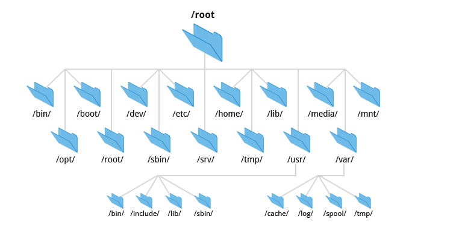
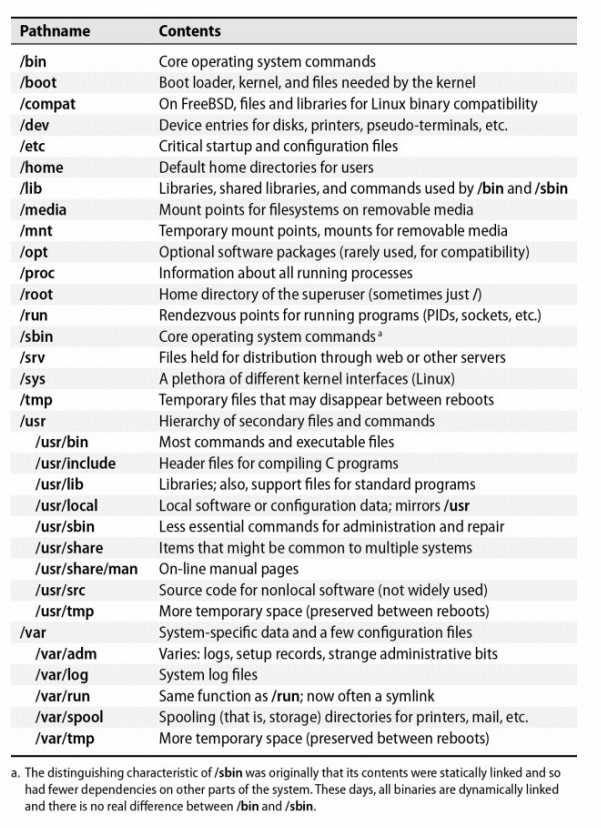
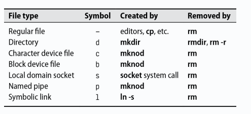
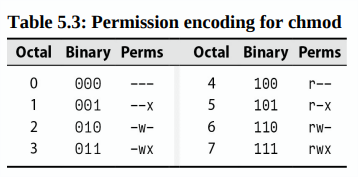

<div align="center">
  <h1 style="text-align: center;font-weight: bold">Laporan Praktikum<br>Workshop Administrasi Jaringan</h1>
  <h4 style="text-align: center;">Dosen Pengampu : Dr. Ferry Astika Saputra, S.T., M.Sc.</h4>
</div>
<br />
<div align="center">
  
  <h3 style="text-align: center;">Disusun Oleh :</h3>
  <p style="text-align: center;">
    <strong>Calvin Raditya Sandy Winarto</strong><br>
    <strong>3123500009</strong><br>
    <strong>2 D3 IT A</strong>
  </p>

<h3 style="text-align: center;line-height: 1.5">Politeknik Elektronika Negeri Surabaya<br>Departemen Teknik Informatika Dan Komputer<br>Program Studi Teknik Informatika<br>2025/2026</h3>
  <hr>
</div>
<br>


<!-- - [Apa itu TCP/IP?](#apa-itu-tcpip)
- [Analisis File http.cap dengan Wireshark](#analisis-file-httpcap-dengan-wireshark)
- [Type of data deliveries](#type-of-data-deliveries)
- [Kesimpulan](#kesimpulan) -->

# Chapter 5 Filesystem

   [](img)

Sistem berkas digunakan untuk mengatur dan merepresentasikan penyimpanan dalam sistem. Terdiri dari `namespace`, `API`, `model keamanan`, dan `implementasi`. Sistem berkas modern terus berkembang dengan peningkatan `kecepatan`, `keandalan`, dan `fitur`. Beberapa sistem berkas umum adalah `ext4`, `XFS`, `UFS`, `ZFS`, `Btrfs`, serta `FAT` dan `NTFS` untuk Windows.

- Tujuan utama: Mengatur dan merepresentasikan penyimpanan.
- Empat komponen utama:
    - **Namespace** – Menamai dan mengatur hirarki berkas.
    - **API** – Panggilan sistem untuk navigasi dan manipulasi.
    - **Model keamanan** – Perlindungan dan berbagi berkas.
    - **Implementasi** – Penghubung antara model logis dan perangkat keras.
- **Sistem berkas umum:** ext4, XFS, UFS, ZFS, Btrfs (Linux/Unix), FAT, NTFS (Windows), ISO 9660 (CD/DVD).
- **Perkembangan modern:** Fokus pada kecepatan, keandalan, dan fitur tambahan.

## Pathnames
Untuk menjaga ketepatan terminologi, sebaiknya menggunakan `"direktori"` daripada `"folder"` dalam konteks teknis. Dalam sistem berkas, `pathname` adalah serangkaian direktori yang menunjukkan lokasi suatu berkas. `Pathname absolut` menunjukkan lokasi lengkap dalam hierarki sistem berkas `(misalnya, /home/username/file.txt)`, sedangkan `pathname relatif` bergantung pada direktori kerja saat ini `(misalnya, ./file.txt)`.

## Filesystem Mounting and Unmounting
Sistem berkas terdiri dari berbagai komponen yang mencakup berkas, `direktori`, dan `subdirektori`, yang secara keseluruhan membentuk struktur pohon berkas. Cabang dalam pohon ini disebut sistem berkas, dan perintah mount digunakan untuk memasangnya ke dalam pohon berkas utama. Perintah mount memetakan sebuah direktori dalam pohon berkas yang ada—disebut `titik pemasangan (mount point)` ke akar sistem berkas baru.
```
    # Mount the filesystem on /dev/sda4 to /users
    mount /dev/sda4 /users
```

## Organization of the file tree
Linux menyediakan opsi lazy unmount dengan perintah `umount -l`, yang menghapus sistem berkas dari hierarki penamaan tanpa langsung `meng-unmount`. Sistem berkas akan benar-benar terlepas setelah tidak ada proses yang menggunakannya.

Opsi `umount -f` digunakan untuk memaksa unmount, berguna saat sistem berkas dalam keadaan sibuk. Namun, daripada langsung menggunakan `umount -f`, lebih baik terlebih dahulu mengetahui proses yang masih menggunakan sistem berkas dengan perintah berikut:

- Menampilkan proses yang menggunakan sistem berkas
    ```
        lsof /home/abdou
    ```
- Menyelidiki proses yang menggunakan sistem berkas dengan PID tertentu
    ```
        ps up "1234 5678 91011"
    ```
    
## Organization of the file tree
`Sistem UNIX` memiliki struktur yang bervariasi, dengan konvensi penamaan yang tidak selalu kompatibel, sehingga menyulitkan pengembangan. Sistem berkas root mencakup direktori utama serta berkas penting untuk operasi sistem. Beberapa direktori utama memiliki fungsi khusus, seperti `/boot` untuk `kernel`, `/etc` untuk `konfigurasi`, `/bin` dan `/sbin` untuk `utilitas penting`, serta `/tmp` untuk `berkas sementara`.

Direktori `/lib`, `/usr`, dan `/var` menyimpan `pustaka bersama, program non-kritis`, serta data yang sering berubah. `/dev` sekarang merupakan `sistem berkas virtual` yang di-mount terpisah, bukan bagian dari sistem berkas root secara langsung.

[](img)

### Struktur Sistem Berkas Root
- **/boot** → Menyimpan kernel sistem operasi (lokasi dapat bervariasi).
- **/etc** → Berisi file konfigurasi sistem yang krusial.
- **/bin** dan **/sbin** → Utilitas penting yang dibutuhkan saat booting.
- **/tmp** → Menyimpan berkas sementara.
- **/dev** → Kini merupakan sistem berkas virtual, bukan bagian langsung dari root.

### Direktori Tambahan
- **/lib** dan **/lib64** → Menyimpan pustaka bersama, sering kali dipindahkan ke **/usr/lib**.
- **/usr** → Berisi program standar, manual, dan pustaka tambahan.
- **/usr/local** → Digunakan di FreeBSD untuk konfigurasi lokal.
- **/var** → Menyimpan log, spool, dan berkas yang sering berubah.
- **/usr** dan **/var** harus selalu tersedia agar sistem tetap berjalan dalam mode multiuser.

    [](img)

- Regular files terdiri dari serangkaian byte tanpa struktur yang dipaksakan oleh sistem berkas. File biasa mencakup **file teks, data, program yang dapat dieksekusi, dan pustaka bersama**.
- **Direktori** berfungsi sebagai referensi yang mengarah ke file lain dalam sistem berkas.
- **Hard Links** memungkinkan satu file memiliki beberapa nama yang merujuk ke inode yang sama.
- Perintah `ln` digunakan untuk membuat tautan keras ke file yang sudah ada, sementara opsi `-i` pada `ls` menampilkan jumlah hard link untuk setiap file.

## Character and block device files
Program berkomunikasi dengan perangkat keras melalui **file perangkat** yang dikelola oleh driver kernel. Kernel tetap sederhana dengan menggunakan **nomor perangkat mayor dan minor untuk membedakan perangkat**. Direktori `/dev` awalnya dikelola secara manual, tetapi kini diatur otomatis oleh sistem. Selain itu, soket domain lokal, pipa bernama, dan tautan simbolik membantu komunikasi antarproses dan fleksibilitas sistem berkas.

- **File perangkat** digunakan untuk berkomunikasi dengan perangkat keras.
- **Nomor mayor** menunjukkan driver perangkat, nomor minor menunjukkan unit perangkat.
- Dulu perangkat dibuat dengan `mknod`, kini dikelola otomatis oleh kernel dan daemon.
- ***Soket domain lokal*** dan **pipa bernama** memungkinkan komunikasi antarproses.
- **Tautan simbolik** mempermudah pengelolaan berkas, bahkan lintas sistem berkas.

    ```
        $ ln -s /bin /usr/bin
    ```
    ```
        $ ls -l /usr/bin
        lrwxrwxrwx 1 root root 4 Mar  1  2020 /usr/bin -> /bin
    ```

## File attributes
Dalam sistem berkas Unix dan Linux, setiap file memiliki mode akses 12 bit, terdiri dari:
- **9 bit hak akses:** membaca (r), menulis (w), dan menjalankan (x) untuk pemilik, grup, dan pengguna lainnya.
- **3 bit khusus:** mempengaruhi eksekusi program.
- **4 bit tipe file:** ditentukan saat file dibuat dan tidak dapat diubah.

Perintah `chmod` memungkinkan pemilik file dan superuser untuk mengubah mode akses sesuai kebutuhan.

## Permission bits
Dalam sistem berkas Unix dan Linux, izin akses file dibagi menjadi tiga kelompok `pemilik (user/u)`, `grup (group/g)`, dan `lainnya (others/o)`, masing-masing memiliki izin **membaca (r)**, **menulis (w)**, dan **mengeksekusi (x)**.
Izin ini direpresentasikan dalam format oktal dan mempengaruhi bagaimana file atau direktori dapat diakses dan dimodifikasi.

Untuk file 
- **Bit baca (r):** memungkinkan file dibaca.
- **Bit tulis (w):** memungkinkan modifikasi file, tetapi penghapusan bergantung pada izin direktori induk.
- **Bit eksekusi (x):** memungkinkan file dijalankan, baik sebagai biner atau skrip dengan shebang (#!).

Untuk direktori
- **Bit eksekusi (x) atau scan:** memungkinkan akses ke direktori tanpa melihat isinya.
- **Bit baca (r) + eksekusi (x):** memungkinkan melihat isi direktori.
- **Bit tulis (w) + eksekusi (x):** memungkinkan pembuatan, penghapusan, atau pengubahan nama file dalam direktori.

## Dalam sistem berkas Unix dan Linux, terdapat beberapa bit khusus yang mempengaruhi eksekusi file dan perilaku direktori

- **Setuid (4000) & Setgid (2000):**
    - Setuid: Saat file dieksekusi, pemilik proses berubah menjadi pemilik file.
    - Setgid: Saat file dieksekusi, grup proses berubah menjadi grup file. Jika diterapkan pada direktori, semua file baru di dalamnya akan mewarisi grup direktori.

- **Sticky Bit (1000):**
    - Diterapkan pada direktori untuk mencegah pengguna menghapus atau mengganti nama file milik orang lain. Berguna untuk direktori umum seperti `/tmp`.

- **Perintah ls:**
    - Menampilkan daftar file dan direktori.
    - Opsi `-l` menunjukkan informasi detail seperti izin **file**, **pemilik**, **grup**, **ukuran**, dan **waktu modifikasi**.
    - **Direktori memiliki minimal dua hard link:** . (diri sendiri) dan .. (direktori induk).
    - Untuk **file perangkat**, `ls` menampilkan **nomor mayor/minor** sebagai identifikasi perangkat keras.

## chmod change permissions
Perintah chmod mengubah mode dari sebuah file. Anda dapat menggunakan notasi oktal atau notasi simbolik.
    
[](img)

**Examples of chmod's mnemonic syntax:**

| **Specifier**     | **Arti** |
|-------------------|---------|
| `u+w`            | Menambahkan izin tulis untuk pemilik file. |
| `ug=rw,o=r`      | Memberikan izin baca/tulis kepada pemilik dan grup, serta izin baca kepada lainnya. |
| `a-x`           | Menghapus izin eksekusi untuk semua pengguna. |
| `ug=srx, o=`    | Menetapkan setuid, setgid, dan memberikan izin baca/eksekusi untuk pemilik dan grup, serta tidak memberikan izin kepada lainnya. |
| `g=u`           | Membuat izin grup sama dengan izin pemilik. |

Anda juga dapat menetapkan mode izin dengan menyalin izin dari file lain menggunakan opsi --reference.
```
    chmod --reference=file_sumber file_target
```

## chown: change ownership
Perintah chown mengubah pemilik dan grup sebuah berkas. Opsi -R menyebabkan chown mengubah kepemilikan isi berkas secara rekursif.
```
    $ chown -R abdou:users /home/abdou
```

## chgrp: change group
Perintah chgrp mengubah grup sebuah file. Opsi -R menyebabkan chgrp mengubah grup isi file secara rekursif.
```
    $ chgrp -R users /home/abdou
```

## umask: set default permissions
Perintah umask menetapkan izin default untuk file dan direktori baru. Perintah umask adalah sebuah bit mask yang dikurangkan dari izin default untuk menentukan izin yang sebenarnya.
```
    $ umask 022
```

| Octal | Binary | Perms |
|-------|--------|-------|
| 0     | 000    | ---   |
| 1     | 001    | --x   |
| 2     | 010    | -w-   |
| 3     | 011    | -wx   |
| 4     | 100    | r--   |
| 5     | 101    | r-x   |
| 6     | 110    | rw-   |
| 7     | 111    | rwx   |

## Access Control Lists
ACL memungkinkan banyak pemilik dan izin berbeda untuk sekelompok pengguna pada file tertentu, memperluas model perizinan Unix konvensional. Setiap aturan ACL disebut Access Control Entry (ACE), yang terdiri dari pengguna atau grup, topeng izin, dan tipe (izin atau tolak).

Untuk melihat ACL pada sebuah file, gunakan perintah:
```
    $ getfacl /etc/passwd
```
Untuk mengatur ACL, gunakan perintah:
```
    $ setfacl -m u:abdou:rw /etc/passwd
```
## Implementasi ACL
Secara teoritis, pemeliharaan dan penegakan Access Control Lists (ACL) dapat dilakukan oleh beberapa komponen dalam sistem. ACL dapat diterapkan oleh kernel untuk seluruh sistem berkas, oleh sistem berkas itu sendiri, atau bahkan oleh perangkat lunak tingkat atas seperti server NFS dan SMB.

## POSIX ACLs
**POSIX ACLs** adalah implementasi ACL tradisional pada sistem Unix. Jenis ACL ini didukung oleh mayoritas sistem operasi berbasis Unix, seperti **Linux**, **FreeBSD**, dan **Solaris**.

# POSIX ACLs
**POSIX ACLs** adalah metode tradisional untuk mengatur izin akses pada sistem Unix. ACL ini memungkinkan penetapan izin yang lebih fleksibel dibandingkan model izin standar Unix.  

**Format Entri POSIX ACLs**  

| **Format**                | **Contoh**           | **Menetapkan Izin Untuk**         |
|---------------------------|---------------------|------------------------------------|
| `user::perms`            | `user:rw-`          | Pemilik berkas                    |
| `user:username:perms`    | `user:abdou:rw-`    | Pengguna dengan nama tertentu      |
| `group::perms`           | `group:r-x`         | Grup berkas                        |
| `group:groupname:perms`  | `group:users:r-x`   | Grup dengan nama tertentu          |
| `mask::perms`            | `mask::rwx`         | Izin maksimum                      |
| `other::perms`           | `other::r--`        | Semua pengguna lainnya             |

**Contoh Penggunaan POSIX ACLs**
Menambahkan izin ACL pada file atau direktori:  
```
    $ setfacl -m user:abdou:rwx,group:users:rwx,other::r /home/abdou
```

Melihat izin ACL tanpa header:
```
    $ getfacl --omit-header /home/abdou
```

Output
```
    user::rwx
    user:abdou:rwx
    group::r-x
    group:users:r-x
    mask::rwx
    other::r--
```

## NFSv4 ACLs
NFSv4 ACLs adalah sistem izin yang lebih canggih dan fleksibel dibandingkan POSIX ACLs. ACL ini didukung oleh beberapa sistem operasi berbasis Unix, seperti Linux dan FreeBSD.

**Keunggulan NFSv4 ACLs**
- Menyediakan izin lebih mendetail dibandingkan POSIX ACLs.
- Memiliki default ACL, yang secara otomatis mengatur izin pada file dan direktori baru.

**Izin Berkas dalam NFSv4**


| **Izin** | **Deskripsi**                          |
|----------|----------------------------------------|
| **r**    | Membaca isi berkas/direktori          |
| **w**    | Menulis atau mengubah berkas          |
| **x**    | Menjalankan berkas sebagai program    |
| **d**    | Menghapus berkas                      |
| **a**    | Mengubah ACL berkas                   |
| **D**    | Menghapus file dalam direktori       |

NFSv4 ACLs memungkinkan pengelolaan izin yang lebih detail dan cocok digunakan dalam sistem yang memerlukan kontrol akses yang kompleks.