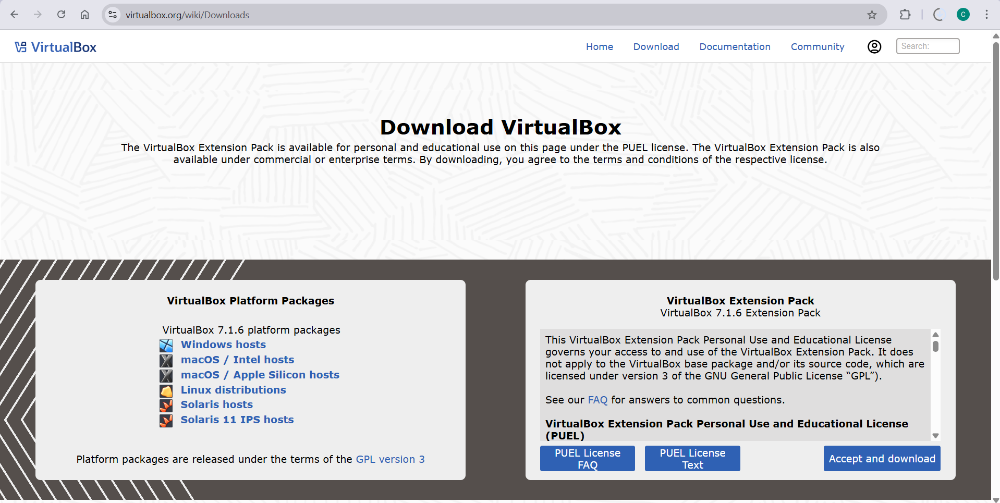
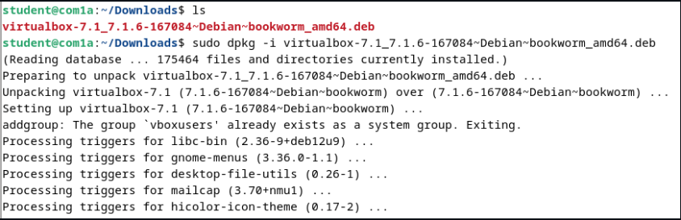
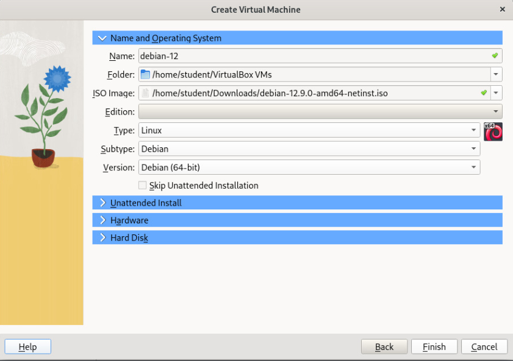
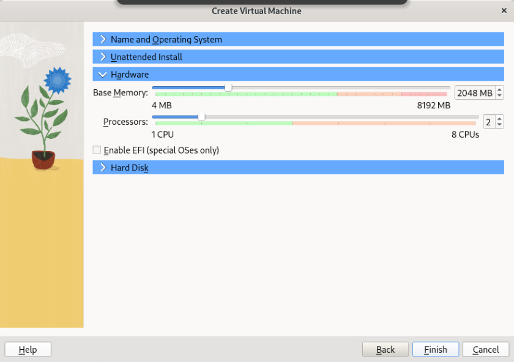
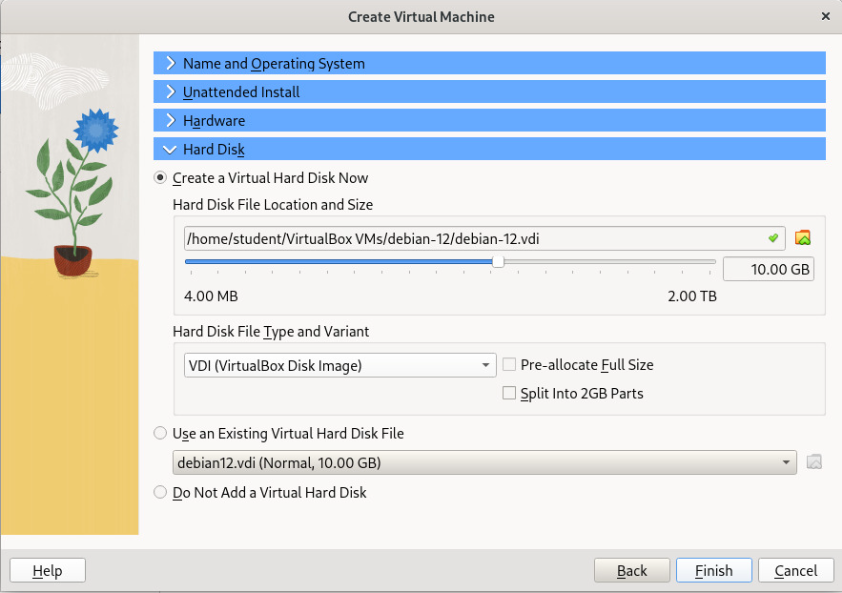
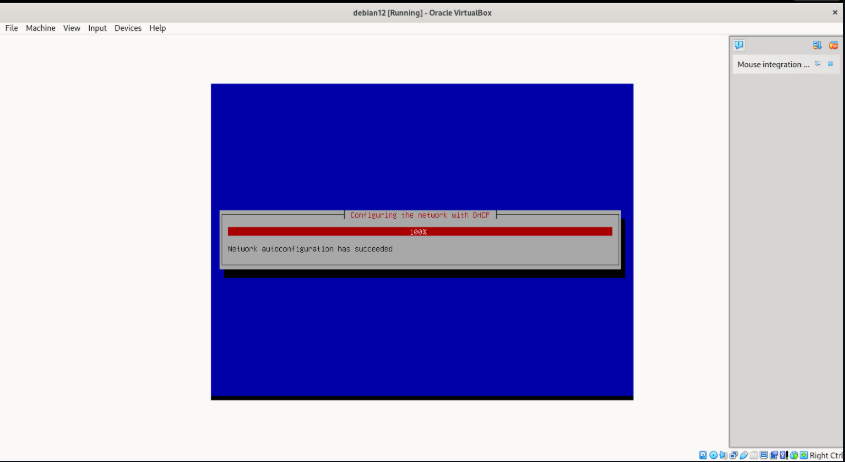
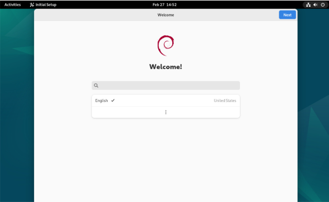
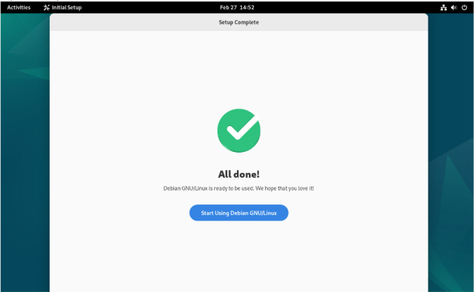

  <h1 style="text-align: center;font-weight: bold">Laporan Praktikum Workshop Administrasi Jaringan</h1>
  <h4 style="text-align: center;">Dosen Pengampu : Dr. Ferry Astika Saputra, S.T., M.Sc.</h4>

 

  
  <h3 style="text-align: center;">Disusun Oleh :</h3>
  

    <strong>Calvin Raditya Sandy Winarto</strong> 
    <strong>3123500009</strong> 
    <strong>2 D3 IT A</strong>
  

<h3 style="text-align: center;line-height: 1.5">Politeknik Elektronika Negeri Surabaya Departemen Teknik Informatika Dan Komputer Program Studi Teknik Informatika 2025/2026</h3>
  

 

## Instalasi Debian dan Oracle Virtual Box

### Download VirtualBox

Download VirtualBox di situs resmi https://www.virtualbox.org/wiki/Downloads sesuaikan dengan Sistem Operasi yang dipakai

### Download ISO Debian

Download ISO Debian di situs resmi https://www.debian.org/download 

### Install VirtualBox

Install VirtualBox dengan perintah 

    sudo dpkg -i virtualbox-7.1_7.1.6-167084~Debian~bookworm_amd64.deb

### Konfigurasi Virtual Machine

Pilih **New Virtual Machine** sesuaikan Nama dan Sistem Operasi yang akan digunakan

Sesuaikan penyimpanan sesuai kebutuhan

Sesuaikan Hard Disk seperti gambar dibawah ini

### Run Virtual Machine

Jalankan dan tunggu sampai debian pada VM sudah terinstall dan terinisialisasi dengan benar

Jika sudah seperti gambar di bawah, maka bisa dipastikan install debian 12 pada VirtualBox telah berhasil

Selanjutnya klik Next hingga done, jika sudah seperti gambar di bawah maka debian pada VirtualBox sudah siap digunakan

