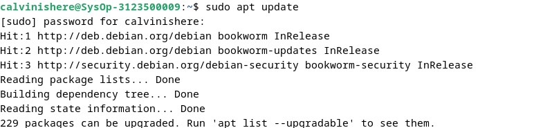
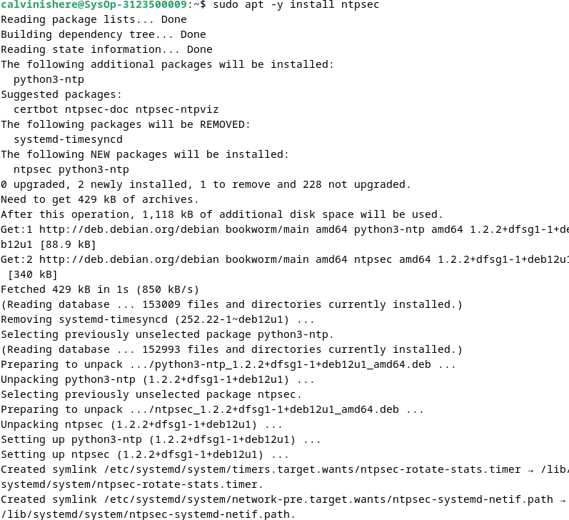
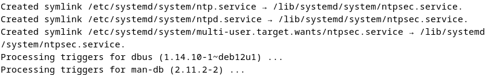
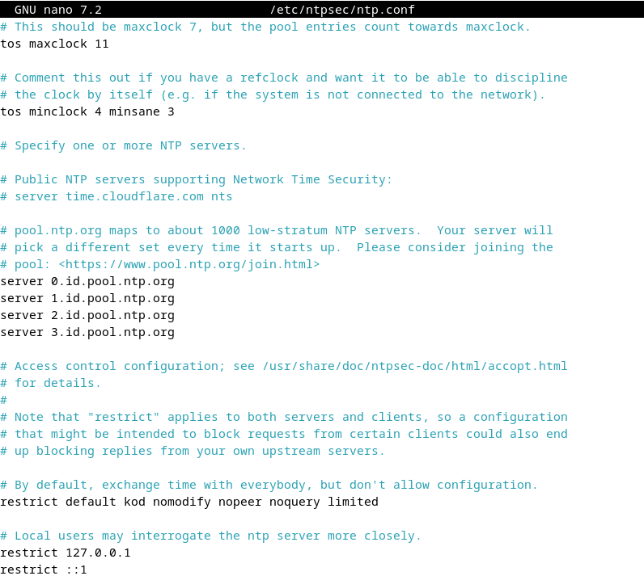
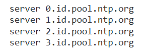
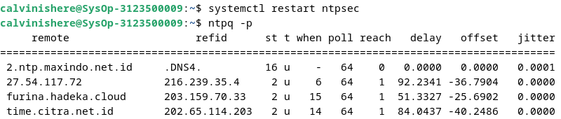
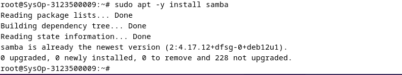

  <h1 style="text-align: center;font-weight: bold">Laporan Praktikum Workshop Administrasi Jaringan</h1>
  <h4 style="text-align: center;">Dosen Pengampu : Dr. Ferry Astika Saputra, S.T., M.Sc.</h4>

 

  
  <h3 style="text-align: center;">Disusun Oleh :</h3>
  

    <strong>Calvin Raditya Sandy Winarto</strong> 
    <strong>3123500009</strong> 
    <strong>2 D3 IT A</strong>
  

<h3 style="text-align: center;line-height: 1.5">Politeknik Elektronika Negeri Surabaya Departemen Teknik Informatika Dan Komputer Program Studi Teknik Informatika 2025/2026</h3>
  

 

## A. Instalasi dan Konfigurasi NTP Client

Untuk memastikan waktu pada sistem tetap sinkron dengan waktu global, kita perlu menginstal dan mengonfigurasi NTP client. Pada Debian 12, kita dapat menggunakan paket ntp atau ntpsec. Sinkronisasi waktu ini penting untuk menjaga akurasi sistem, terutama pada server yang bergantung pada waktu yang presisi.

Langkah pertama adalah menginstal paket yang diperlukan. Setelah instalasi, konfigurasi dilakukan dengan menyesuaikan server NTP yang akan digunakan. Dalam hal ini, kita akan menggunakan server NTP dari Indonesia. Setelah konfigurasi selesai, layanan NTP harus dijalankan dan diperiksa apakah sinkronisasi telah berhasil.

### Langkah instalasi

Sebelum melakukan instalasi sebaiknnya lakukan update terlebih dahulu dengan perintah

    sudo apt update

Setelah update masukkan perintah install

    sudo apt -y install ntpsec

### Konfigurasi NTP Client

    sudo nano /etc/ntpsec/ntp.conf

Update server bawaan dengan server id dibawah 

### Memeriksa Status Sinkronisasi

Restart ntpsec dengan perintah

    systemctl restart ntpsec

Setelah restart jalankan perintah `ntpq -p` untuk melihat daftar server **NTP** yang digunakan dan status sinkronisasi.

   

## B. Instalasi dan Konfigurasi Samba

Samba adalah layanan yang memungkinkan berbagi file antar sistem Linux dan Windows. Dalam konfigurasi ini, kita akan membuat dua jenis shared folder: Public Shared Folder yang dapat diakses oleh semua pengguna tanpa autentikasi, serta Limited Shared Folder yang hanya dapat diakses oleh pengguna tertentu. Selain itu, kita juga akan mengakses folder yang dibagikan melalui Command Line Interface (CLI).

### Instalasi

Sebelum menginstall samba masuk ke direktori root dengan perintah `su -` lalu ketikkan perintah dibawah untuk menginstall samba

    sudo apt -y install samba

   

Setelah samba terinstall jalankan perintah dibawah untuk membuat direktori baru bernama `share` di dalam direktori `/home`

    mkdir /home/share

Jika direktori `share` sudah dibuat sekarang jalankan perintah dibawah untuk mengubah izin akses pada direktori `/home/share` agar dapat dibaca, ditulis, dan dieksekusi oleh semua pengguna.

    chmod 777 /home/share

Setelah semuanya berhasil restart samba dengan perintah

    systemctl restart smbd

Akses folder melalui windows
 

Akses folder melalui linux
 

## C. Rangkuman tentang Manajemen Paket

### Sumber Perangkat Lunak Debian GNU/Linux
Debian menggunakan **repositori** untuk distribusi perangkat lunak, memungkinkan pengelolaan dan pembaruan sistem secara terpusat tanpa perlu mengunjungi situs aplikasi secara langsung.

#### 1. Berkas sources.list
    apt edit-sources

    nano /etc/apt/sources.list

#### Elemen penting dalam sources.list:
  - `deb` → Repositori biner
  - `deb-src` → Repositori sumber
  - `http/https` → Alamat server
  - `bookworm/bookworm-security` → Cabang repositori
  - `main, contrib, non-free, non-free-firmware` → Komponen repositori

#### 2. Cabang & Komponen Repositori
  - main → 100% bebas sesuai DFSG, mendapat dukungan penuh
  - contrib → Bebas, tetapi bergantung pada non-free
  - non-free → Tidak sesuai DFSG
  - non-free-firmware → Firmware non-free, sejak Debian 12

#### 3. Paket Backport
Backports menyediakan versi terbaru dari aplikasi pada repositori pengembangan yang dikompilasi ulang agar kompatibel dengan rilis stabil. Tidak diaktifkan secara default tetapi menjaga stabilitas sistem.

#### 4. Memodifikasi Repositori
Sebelum menambah `contrib` atau `non-free`, perhatikan:
  - Kebebasan terbatas (tidak sepenuhnya bebas)
  - Dukungan terbatas (hanya main yang mendapat dukungan penuh)
  - Integritas sistem (penggunaan non-free dapat mengubah sistem Debian)

Contoh konfigurasi sources.list

  - Hanya paket bebas:

        apt edit-sources

  - Paket bebas & proprietary

        deb http://deb.debian.org/debian/ bookworm main contrib non-free non-free-firmware

