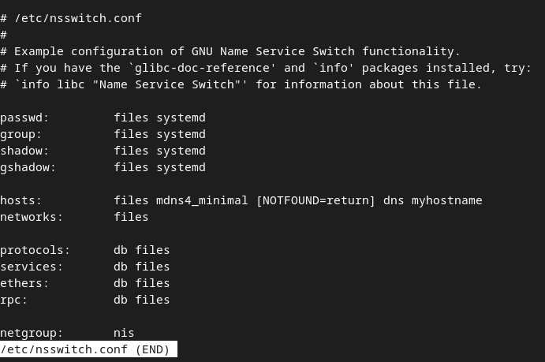
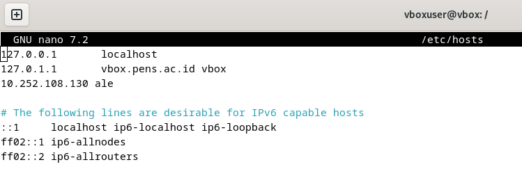
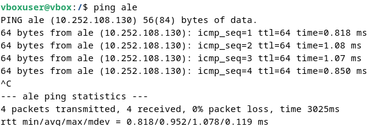

  <h1 style="text-align: center;font-weight: bold">Laporan Praktikum Workshop Administrasi Jaringan</h1>
  <h4 style="text-align: center;">Dosen Pengampu : Dr. Ferry Astika Saputra, S.T., M.Sc.</h4>

 

  
  <h3 style="text-align: center;">Disusun Oleh :</h3>
  

    <strong>Calvin Raditya Sandy Winarto</strong> 
    <strong>3123500009</strong> 
    <strong>2 D3 IT A</strong>
  

<h3 style="text-align: center;line-height: 1.5">Politeknik Elektronika Negeri Surabaya Departemen Teknik Informatika Dan Komputer Program Studi Teknik Informatika 2025/2026</h3>
  

 

## Ekosistem Internet dan DNS Concept

#### Pengertian DNS

Domain Name System (DNS) adalah sistem yang digunakan untuk menerjemahkan nama domain seperti google.com menjadi alamat IP yang dapat dimengerti oleh komputer dan perangkat jaringan. Tanpa DNS, pengguna harus mengingat alamat IP setiap situs web yang ingin mereka kunjungi.

### Cara Kerja DNS

Saat pengguna memasukkan domain di browser, sistem akan mencari alamat IP melalui cache lokal atau meneruskan permintaan ke DNS Resolver. Jika belum ditemukan, proses pencarian berlanjut ke Root DNS Server, kemudian ke TLD DNS Server (seperti .com atau .org), hingga mencapai Authoritative Name Server yang menyimpan alamat IP domain tersebut. Setelah alamat IP diperoleh, browser menggunakannya untuk mengakses server website.
- DNS menerjemahkan domain ke alamat IP
- Browser mengecek cache sebelum meminta ke DNS Resolver
- DNS Resolver mencari informasi ke server hirarki DNS
- Proses pencarian: Root Server → TLD Server → Authoritative Server
- Setelah mendapatkan IP, browser menghubungi server website

### Analisis File Konfigurasi /etc/nsswitch.conf
 

### Fungsi /etc/nsswitch.conf
- NSS mengontrol urutan sumber yang digunakan sistem untuk mencari informasi.
- Jenis Informasi yang Dicari
    - Nama pengguna dan grup
    - Kata sandi
    - Nama host dan alamat IP
    - Layanan jaringan
- File lokal (seperti `/etc/passwd`, `/etc/hosts`)
- DNS
- LDAP
- Sumber lain (misalnya NIS, MySQL)

### Fungsi File /etc/hosts
- Memetakan nama host ke alamat IP secara lokal
- Memungkinkan sistem menemukan alamat IP tanpa DNS
- Diprioritaskan sebelum pencarian melalui layanan eksternal

    

### 1. Buka kembali etc/host

### 2. Menambahkan Entri untuk nama Host Ale

### 3. Coba melakukan ping dengan nama host adalah Ale

### 4. Sekarang Cek IP

## Kesimpulan
- **DNS sebagai Tulang Punggung Internet** – DNS berfungsi sebagai sistem penerjemah domain ke alamat IP, memungkinkan akses situs web tanpa perlu mengingat angka IP.
- **Struktur Hierarki DNS** – Proses pencarian DNS melibatkan beberapa tingkat server: Root Server → TLD Server → Authoritative Server.
- **Cache untuk Efisiensi** – Sistem memeriksa cache lokal terlebih dahulu sebelum mengirim permintaan ke server DNS untuk mempercepat akses.
- **Peran File /etc/hosts** – File ini memungkinkan pemetaan nama host ke IP secara lokal, mengurangi ketergantungan pada DNS.
- **Name Service Switch (NSS)** – Mengatur urutan pencarian informasi dalam sistem, termasuk pengguna, kata sandi, dan nama host.
- **Sumber Informasi di NSS** – Sistem dapat mencari informasi dari berbagai sumber, seperti file lokal, DNS, LDAP, dan database lainnya.
- **Keamanan dalam Resolusi DNS** – Serangan seperti DNS Spoofing dapat memanipulasi hasil pencarian, sehingga penggunaan DNSSEC (DNS Security Extensions) penting untuk keamanan.
- **DNS Resolver sebagai Penghubung** – Bertanggung jawab mengelola permintaan pencarian domain dan meneruskannya ke server yang relevan.
- **Pengaruh Kecepatan dan Stabilitas DNS** – Penyedia DNS yang baik (misalnya Google DNS, Cloudflare, OpenDNS) dapat meningkatkan kecepatan dan keandalan akses internet.
- **Internet Bergantung pada DNS** – Tanpa DNS, pengguna harus menggunakan alamat IP langsung, yang akan membuat internet menjadi lebih sulit digunakan secara praktis.