

  <h1 style="text-align: center;font-weight: bold">Workshop Administrasi Jaringan</h1>
  <h4 style="text-align: center;">Dosen Pengampu : Dr. Ferry Astika Saputra, S.T., M.Sc.</h4>

 

  
  <h3 style="text-align: center;">Disusun Oleh :</h3>
  

    <strong>Calvin Raditya Sandy Winarto</strong> 
    <strong>3123500009</strong> 
    <strong>2 D3 IT A</strong>
  

<h3 style="text-align: center;line-height: 1.5">Politeknik Elektronika Negeri Surabaya Departemen Teknik Informatika Dan Komputer Program Studi Teknik Informatika 2025/2026</h3>
  

 

# Menggunakan 2 VM

Pada praktikum ini, digunakan dua Virtual Machine berbasis Debian, satu menggunakan antarmuka grafis (GUI) dan satu lagi hanya menggunakan antarmuka terminal (tanpa GUI). Tujuan utama praktikum adalah melakukan konfigurasi jaringan agar kedua VM dapat saling terhubung. VM pertama (tanpa GUI) dikonfigurasi dengan mode jaringan bridge, sedangkan VM kedua (dengan GUI) menggunakan mode internal network. Fokus praktikum terletak pada proses pengaturan jaringan di VM1, serta pengaturan layanan Samba di VM2 untuk keperluan berbagi file antar mesin virtual.

# Konfigurasi Koneksi VM1 dan VM2

## Network Interface

 [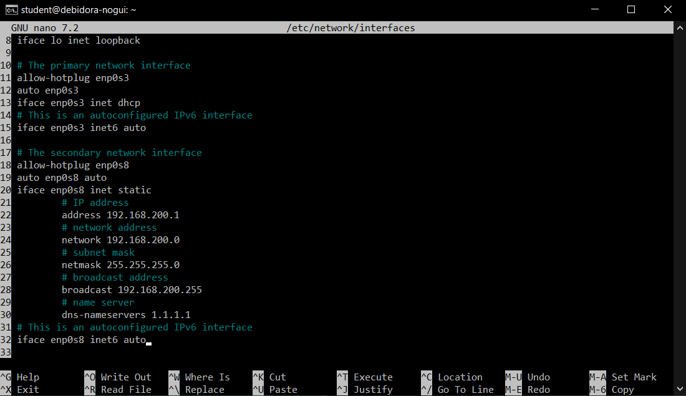](img-1)

Konfigurasi pada gambar adalah mengatur loopback interface (lo) untuk komunikasi internal dengan alamat 127.0.0.1, serta dua interface fisik

- __Interface pertama (enp0s3)__ dikonfigurasi menggunakan opsi allow-hotplug, yang memungkinkan antarmuka jaringan aktif secara otomatis saat perangkat dikenali. Alamat IPv4 untuk interface ini diperoleh secara otomatis melalui DHCP, sementara konfigurasi IPv6 menggunakan metode autoconf untuk memperoleh alamat secara otomatis juga.
- __Interface kedua (enp0s8)__ diaktifkan dengan kombinasi perintah allow-hotplug dan auto, memastikan interface akan menyala saat sistem booting maupun ketika perangkat terdeteksi. Pengaturan IP dilakukan secara manual dengan alamat 192.168.200.1, subnet mask 255.255.255.0, dan alamat broadcast 192.168.200.255. Baris network 192.168.200.0 digunakan untuk mendefinisikan jaringan, dan DNS ditetapkan ke server milik Cloudflare (1.1.1.1). Sementara itu, konfigurasi IPv6 juga mengandalkan autoconfiguration.
- __Alamat loopback 127.0.0.1__ merupakan alamat internal standar pada sistem Unix/Linux yang digunakan untuk komunikasi lokal. Walaupun tidak tertulis secara langsung di dalam file konfigurasi, pernyataan iface lo inet loopback secara tidak langsung menunjukkan penggunaan alamat tersebut, karena sudah menjadi standar bawaan sistem operasi.

## IPv4 Forwarding

[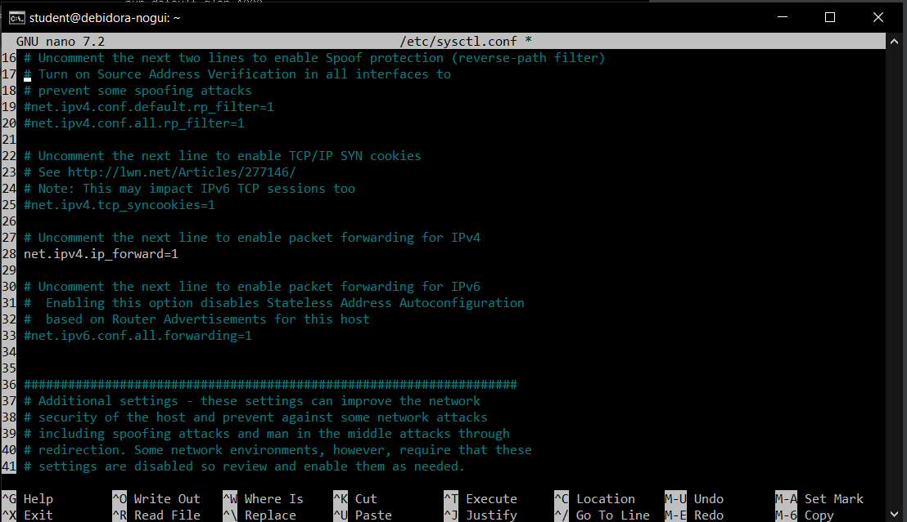](img-2)

Baris __net.ipv4.ip_forward=1__ digunakan untuk mengaktifkan fitur IP forwarding pada sistem Linux, yang memungkinkan sistem untuk meneruskan paket IPv4 dari satu interface jaringan ke interface lainnya. Dengan pengaturan ini, komputer dapat berfungsi sebagai router atau gateway, sehingga dapat menjembatani lalu lintas antar dua atau lebih jaringan. Pengaturan ini sangat penting dalam konfigurasi jaringan seperti NAT, VPN, atau pengaturan jaringan lanjutan lainnya.

## Konfigurasi NAT
### Instalasi iptables dan iptables-persistent
[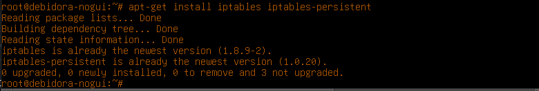](img-3)

Membuat iptables rules pada file __rules.v4__

[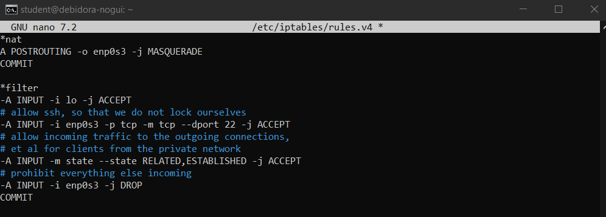](img-4)

Konfigurasi ini akan membuat VM 1 berfungsi sebagai router dengan NAT, yang menghubungkan dua interface ens33 dan ens37, sehingga ens37 dapat terhubung ke internet tetapi tidak menggunakan IP Publik melainkan diwakili oleh ens33.\

Jalankan perintah __sudo iptables-save > /etc/iptables/rules.v4__ untuk menyimpan konfigurasi iptables

[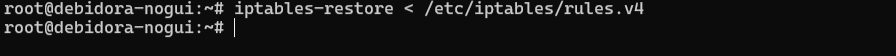](img-5)

### Reboot
Setelah menyelesaikan seluruh proses konfigurasi, jalankan perintah reboot untuk me-restart VM.

## Konfigurasi NTP (NTPSec) pada VM 1

#### Install paket ntpsec
[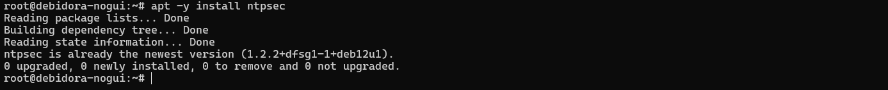](img-6)

#### Konfigurasi server NTP
[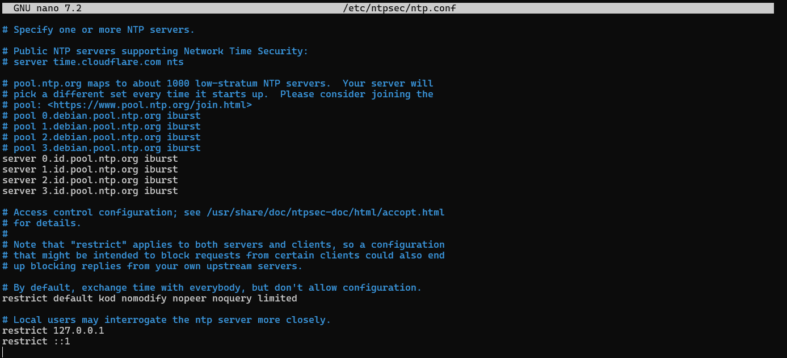](img-7)

#### Restart service ntpsec, jalankan perintah systemctl restart ntpsec
[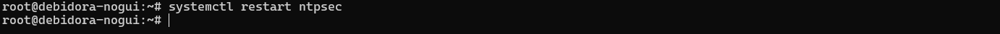](img-8)

#### Kemudian cek menggunakan perintah systemctl status ntpsec
[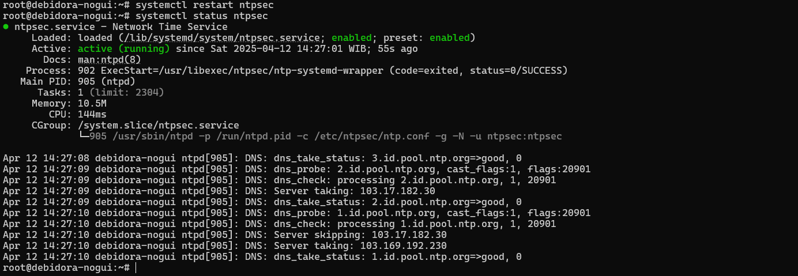](img-9)

#### Validasi NTP Server
[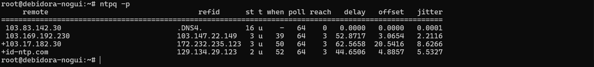](img-10)

## Konfigurasi File Samba pada VM 1

#### Install paket samba
[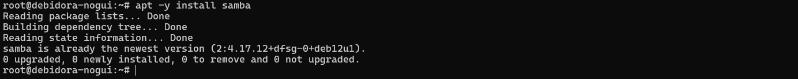](img-11)

#### Buat direktori mkdir `/home/share` dan ubah permission agar bisa diakses `chmod 777 /home/share`
[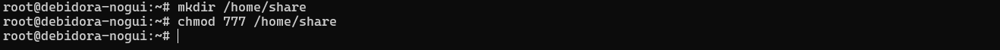](img-12)

#### Konfigurasi samba pada file `/etc/samba/smb.conf`
[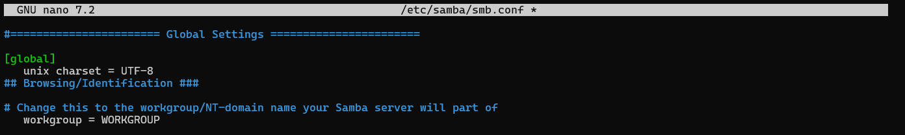](img-13)
[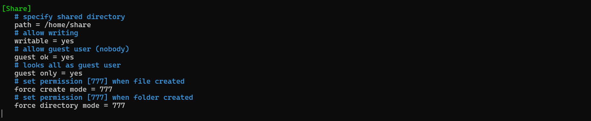](img-14)

#### Restart service dengan perintah systemctl `restart smbd`
[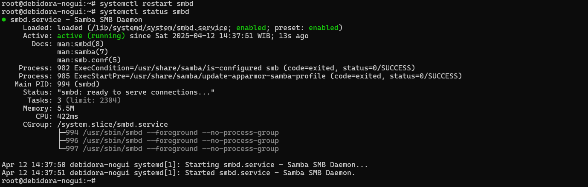](img-15)

## Konfigurasi DNS Server pada VM 1

#### Instalasi paket dengan menjalankan perintah `apt -y install bind9 bind9utils`
[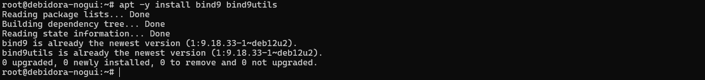](img-16)

#### Lakukan modifikasi pada file `/etc/bind/named.conf` dengan menambahkan `include "/etc/bind/named.conf.internal-zones";`
[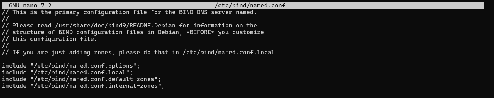](img-17)

#### Modifikasi file `/etc/bind/named.conf.options`
[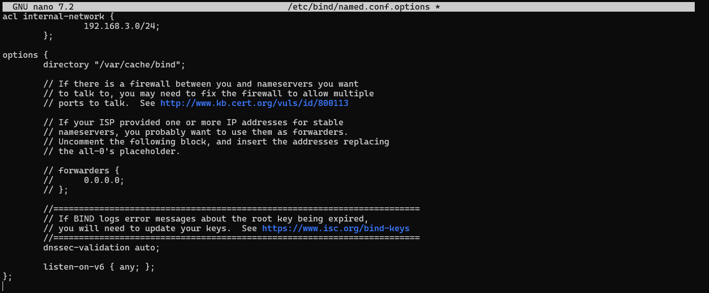](img-18)

#### Konfigurasi internal zone pada file `/etc/bind/named.conf.internal-zones`
[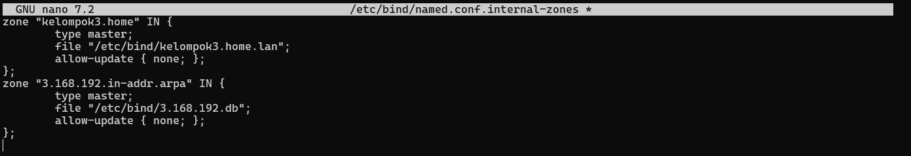](img-19)

#### Modifikasi file `/etc/default/named` dengan menambahkan `-4`
[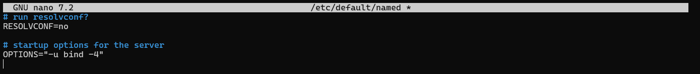](img-20)

#### Membuat file sesuai dengan domain lokal
[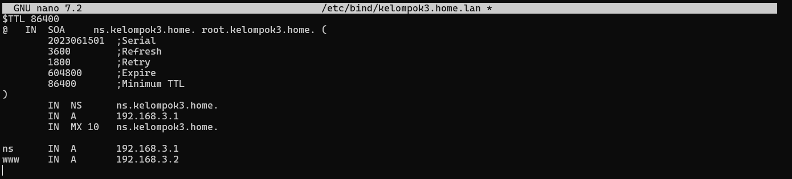](img-21)

#### Membuat file sesuai dengan IP Address
[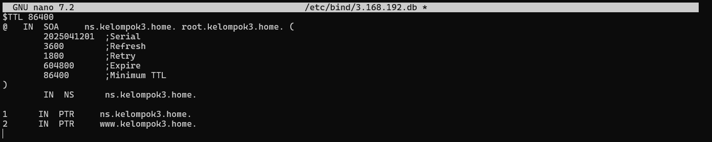](img-22)

## Konfigurasi pada VM 2

VM 2 dikonfigurasi dengan alamat IP yang berada dalam satu jaringan dengan interface internal VM 1 (enp0s3), sehingga keduanya dapat saling terhubung dan berkomunikasi.

[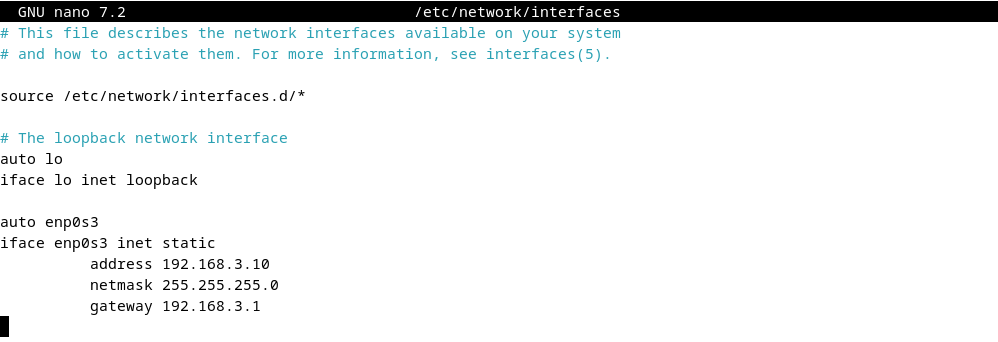](img-23)

Cek koneksi dengan melakukan ping ke gateway
[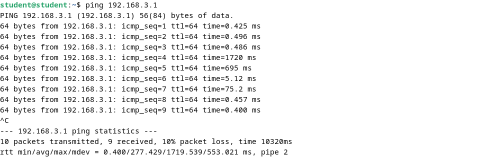](img-24)

Cek koneksi dengan melakukan ping ke DNS server
[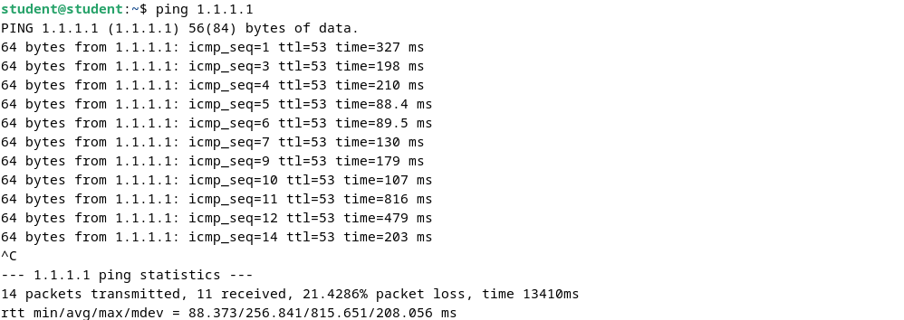](img-25)

Cek koneksi dengan melakukan ping ke domain lokal
[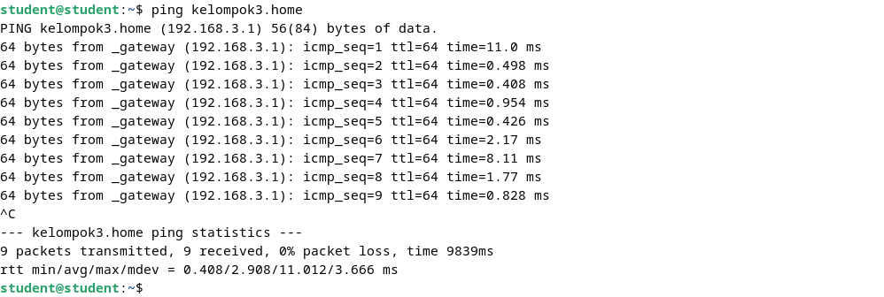](img-26)

Tes akses folder dari Samba (Client)
[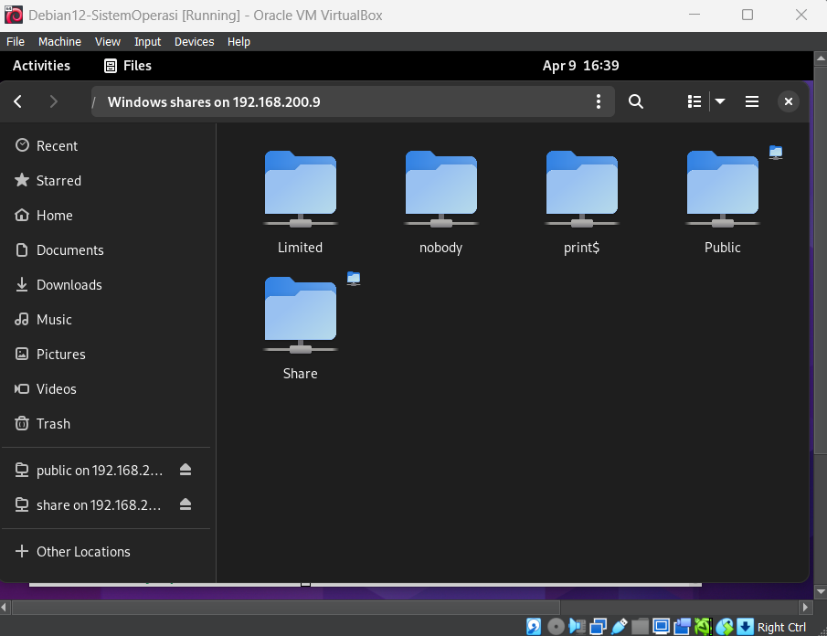](img-27)

Jika folder Share sudah muncul di tampilan file manager client seperti yang terlihat pada gambar, itu berarti konfigurasi Samba di server sudah berjalan dengan benar dan client berhasil mengakses resource sharing yang disediakan oleh server.

### Cek DNS Server (Client) menggunakan nama domain
[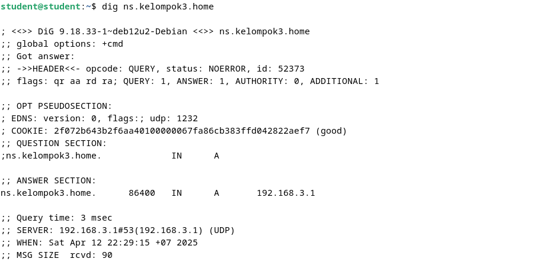](img-28)

Melalui hasil perintah dig, dapat diketahui bahwa domain berhasil di-resolve ke IP address 192.168.3.1 tanpa menimbulkan kesalahan. Ini menunjukkan bahwa setup DNS pada sisi server telah dikonfigurasi dengan benar, dan client mampu mengidentifikasi domain lokal yang telah disetting sebelumnya.

### Cek DNS Server (Client) menggunakan IP address
[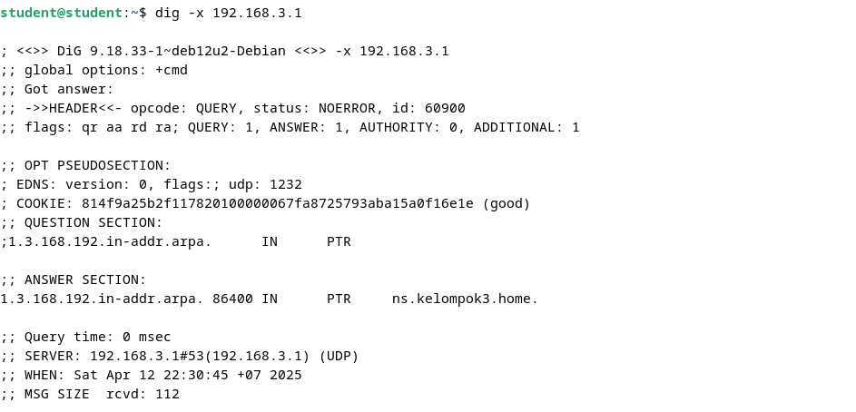](img-29)

Hasil perintah dig -x 192.168.3.1 menunjukkan bahwa IP tersebut berhasil di-resolve menjadi nama domain. Ini menandakan bahwa konfigurasi reverse DNS (PTR record) pada server telah berhasil dilakukan dengan benar dan sistem DNS sudah dapat menerjemahkan alamat IP menjadi hostname sesuai konfigurasi.