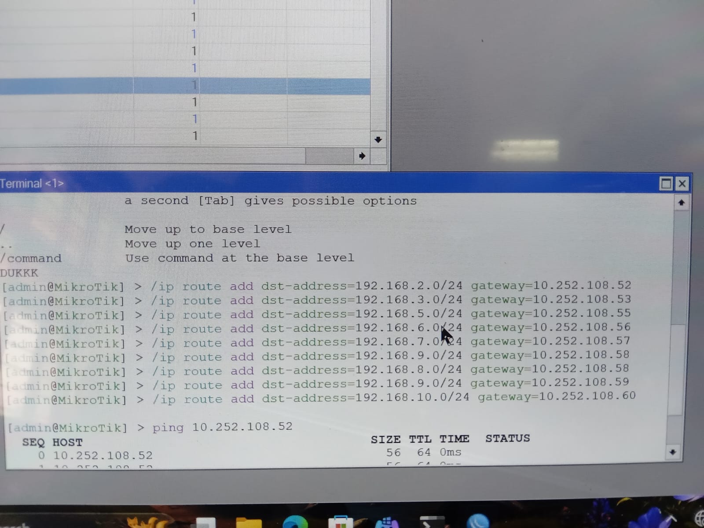
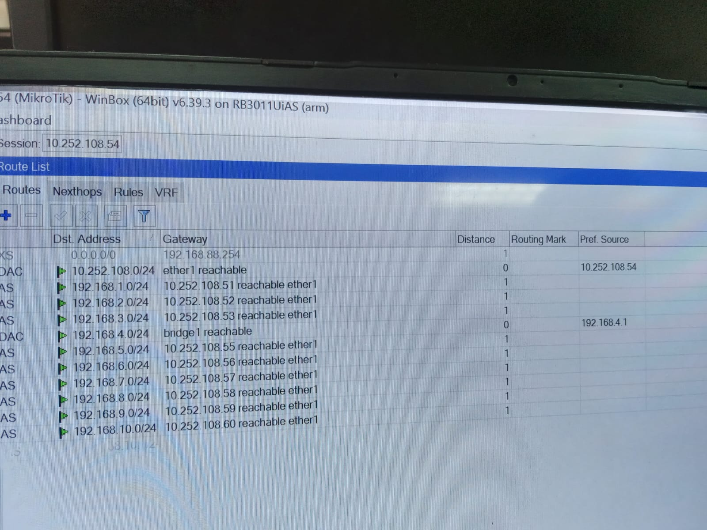
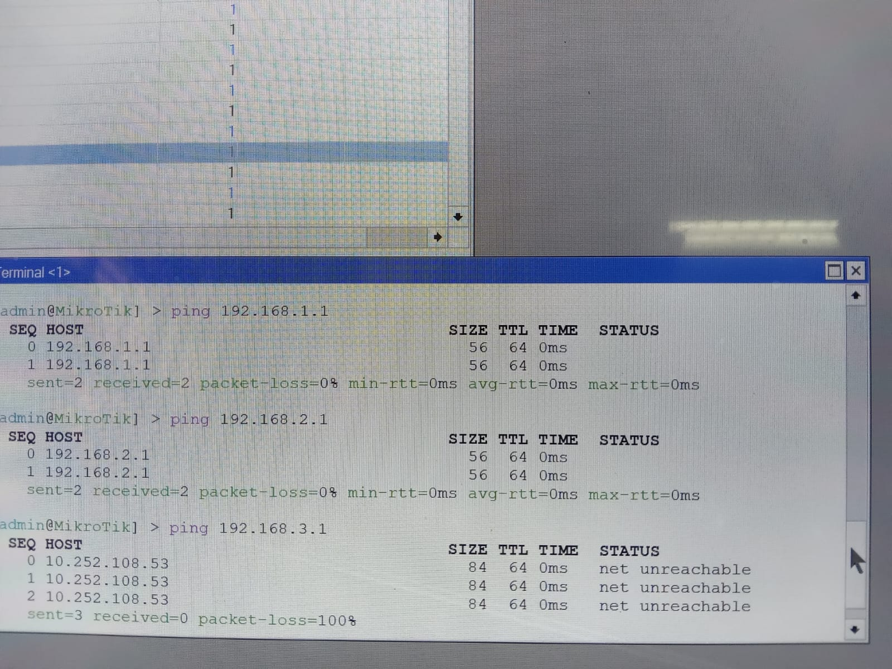
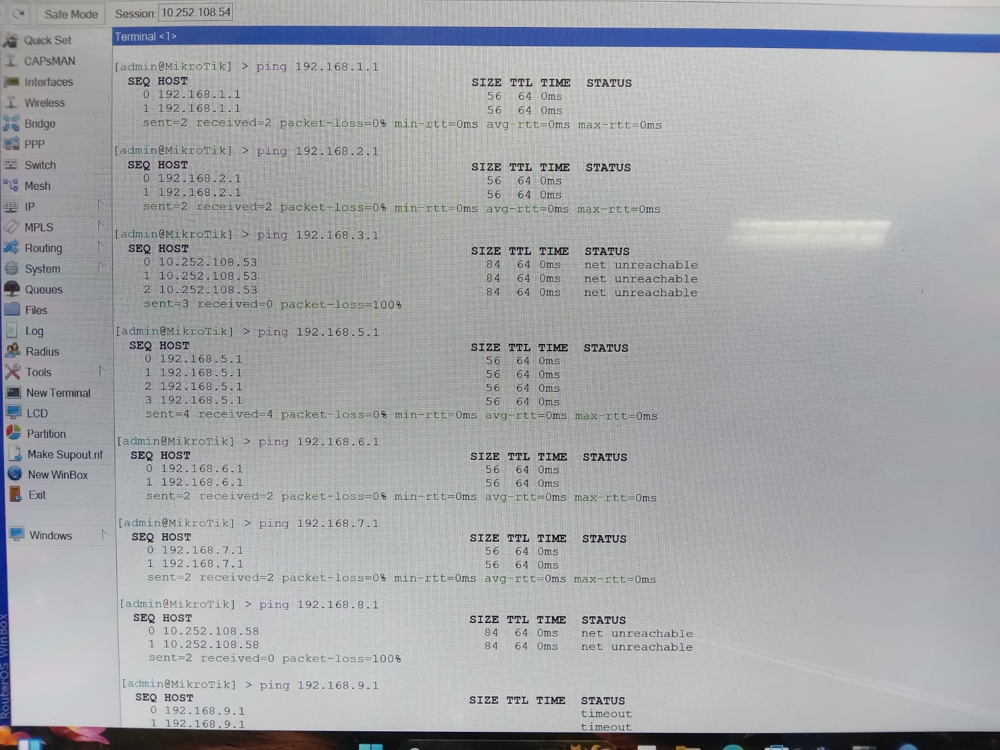

  <h1 style="text-align: center;font-weight: bold">Laporan Praktikum Workshop Administrasi Jaringan</h1>
  <h4 style="text-align: center;">Dosen Pengampu : Dr. Ferry Astika Saputra, S.T., M.Sc.</h4>

 

  
  <h3 style="text-align: center;">Disusun Oleh :</h3>
  

    <strong>Calvin Raditya Sandy Winarto</strong> 
    <strong>3123500009</strong> 
    <strong>2 D3 Teknik Informatika A</strong>
  

<h3 style="text-align: center;line-height: 1.5">Politeknik Elektronika Negeri Surabaya Departemen Teknik Informatika Dan Komputer Program Studi Teknik Informatika 2025/2026</h3>
  

 

## Syarat & Ketentuan
Memerlukan instalasi WinBox untuk melakukan pengujian hubungan antar jaringan.

#### Layer Network

Percobaan ini bertujuan menghubungkan perangkat MikroTik antar kelompok agar laptop di masing-masing LAN bisa saling ping. Setiap kelompok menggunakan IP 10.252.108.5x, di mana x adalah nomor kelompok. Karena kelompok saya adalah kelompok 7, maka IP-nya 10.252.108.57.

Setelah MikroTik terhubung ke jaringan LAN melalui kabel, pengujian koneksi dilakukan dengan perintah ping via Command Prompt di Windows.

### Ping ke device di kelompok lain

Setelah berhasil ping antar IP MikroTik, tahap selanjutnya adalah memastikan konektivitas antar perangkat di jaringan. Laptop yang terhubung ke LAN otomatis mendapat IP 192.168.x.0/24, di mana x adalah nomor kelompok. Kelompok saya menggunakan 192.168.4.0/24 dengan gateway 10.252.108.57.

Tujuan tahap ini adalah agar laptop dapat ping ke IP jaringan kelompok lain, seperti 192.168.1.0, 192.168.2.0, 192.168.3.0, dan seterusnya.

### 1. Menambahkan IP device pada kelompok lain beserta IP gateaway-nya
Langkah pertama yang perlu dilakukan adalah menambahkan alamat IP jaringan dari kelompok lain beserta gateway-nya secara manual. Gateway yang digunakan adalah alamat IP MikroTik milik masing-masing kelompok.

Proses ini dilakukan agar perangkat dalam jaringan dapat saling terhubung dan melakukan komunikasi lintas kelompok. Untuk menambahkan IP dan gateway secara statis, buka aplikasi WinBox, lalu masuk ke menu Terminal dan jalankan perintah yang sesuai. Perintah ini akan mengarahkan lalu lintas menuju jaringan kelompok lain melalui gateway yang telah ditentukan.

`/ip route add dst-address=192.168.x.0/24 gateaway=10.252.108.5x`

Dimana x adalah nomer kelompok, dst-address adalah destination address dan gateaway adalah IP dari MikroTik-nya.

 

Jika sudah ditambahkan semua seperti di atas, maka bisa di cek menggunakan Route List di WinBox dan seharusnya akan muncul seperti ini

 

### 2. Test ping ke device kelompok lain

Setelah tahap pertama sudah selesai, maka bisa lakukan test ping seperti di bawah ini

 
 

Jika test ping seperti di atas sudah berhasil, dan status dari setiap test ping kosong, maka koneksi antar device beda kelompok sudah berhasil dilakukan.